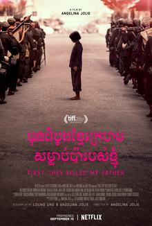

Based on the memoir by Loung Ung of the same name, the film follows Ung starting as a 5-year old girl during the uprising of the Khmer Rogue in Cambodia.

Prior to this film, I had already seen *[The Killing Fields](https://en.wikipedia.org/wiki/The_Killing_Fields_(film))* all the way back in high school (I was so fortunate to be exposed to this back them else I would have no idea).

The film is excellent. I am a big fan of the acting and the cinematic shots; you really see the effects of psychotic, totalitarian regimes on a innocent populous - but this isn't suppose to be film review.
