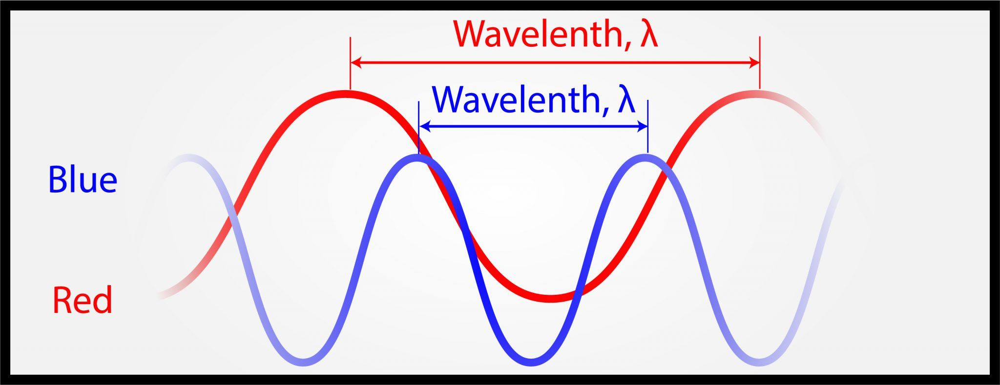
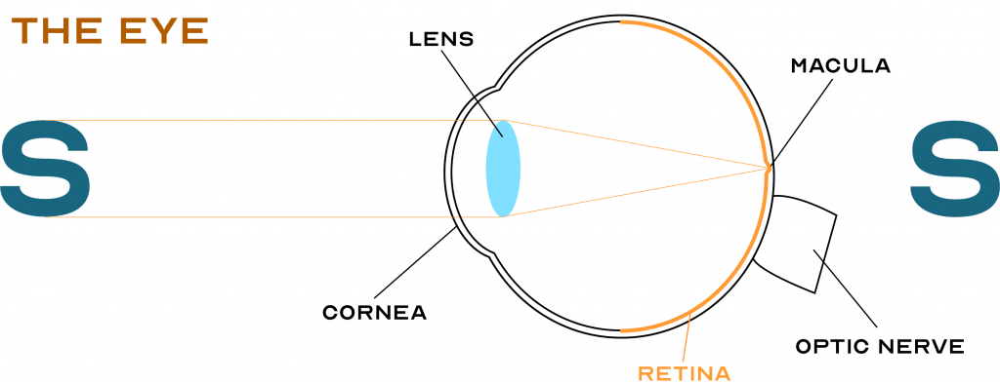
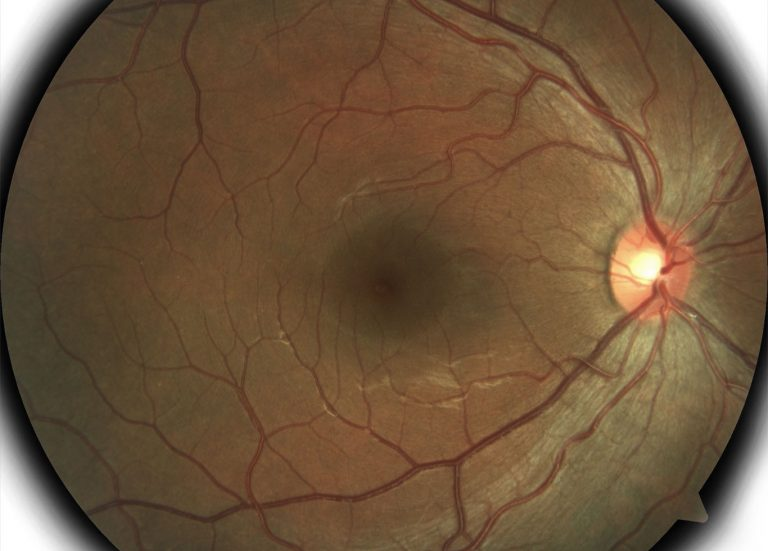
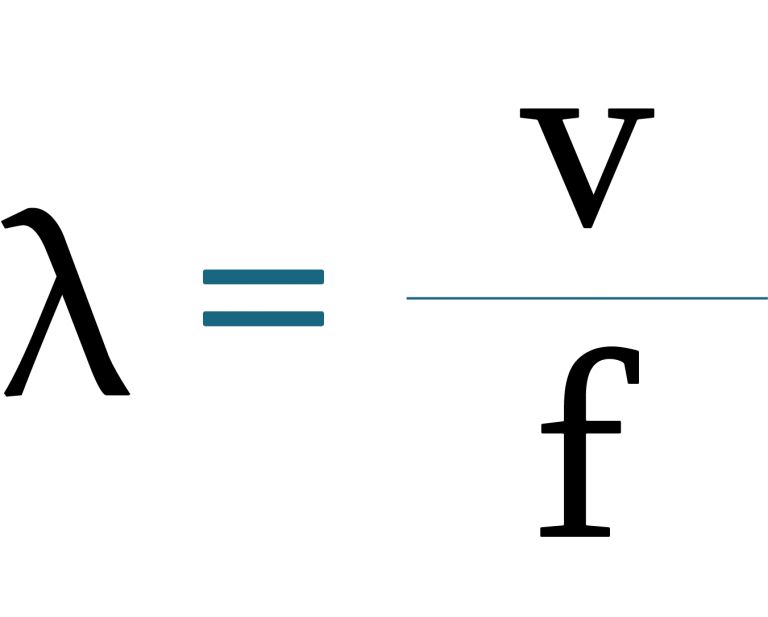
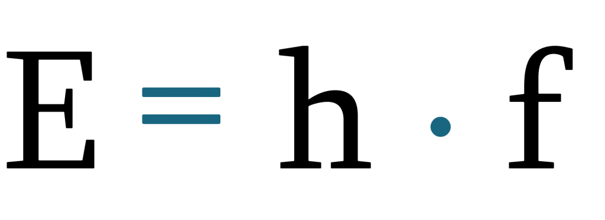

Portals to our world. A way of staying connected, entertained, and educated. Digital devices — Smartphones, tablets, and computers — are now the centre of our lives (Mullan & Chatzitheochari, 2019).

The world is changing. Combined with this change is a surge in health awareness and prevention of disease. We smoke less. One in two adults are physically active (Ministry of Health NZ, 2020). On a sunny day, we are aware of Ultraviolet (UV) exposure, encouraged to wear sunhats, sunglasses and to use sunscreen (Ministry of Health NZ, 2012).

Concerns now raise about our homage towards digital devices and our eye health. One concern is blue light from digital devices, and the possible damage this blue light can cause to our eyes and health.

Enough to raise any alarm bells, before we get into a mass panic, let’s examine the facts more closely:

- What is light especially blue light?
- Why is blue light important?
- How blue light effects our eyes health and sleep?
- What we need to do to ensure our eyes are healthy?

_Make sure you make regular appointments with an eye care professional to ensure your eyes are healthy and you have advice tailored to your eye needs._

Below is a video that briefly explains this topic.



## The Science of Light and what makes Blue Light Blue

Let’s delve into the science of light. We will learn about: light as part of the electromagnetic spectrum, and how we see different colours of light.

Light or more formally, visible light, is a form of **electromagnetic radiation**. Similar to waves in the ocean, electromagnetic radiation is energy in the form of waves passing through an electric and magnetic field that surrounds us.

The electromagnetic **spectrum** contains all the different types of electromagnetic radiation. These types of electromagnetic radiation are different based on a specific property, **wavelength**, **λ** (represented with a lowercase Greek letter called Lambda of which is measured in metres).

Some examples of electromagnetic radiation that we may be familiar with include:

- Radio waves: audio information travels though radio waves from the radio station to your car, making listening to the radio possible (Mai, 2015).
- Microwaves: microwaves transfer thermal energy which can be used to head food (Lucas, 2018).
- X-rays: doctors use X-rays to image bones without cutting open the skin (NHS UK, 2019).

The wavelength of radio waves range from 1 millimetres to 10,000 kilometres. Microwaves (encompassed in radio waves) from 1 mm to 30 cm. And X-rays from 10−11 metres to 10−9 metres (Elert, 2021).

Visible light is unique because this is what our eyes can detect. Visible light is what we can see. The wavelength of visible light ranges from 400 nanometres to 700 nanometres (Helmenstine, 2019). Electromagnetic radiation outside of this range like ultraviolet (UV) light and infrared (IR) still exists but cannot be detected by our eyes.

Different wavelengths of visible light describe different colours of visible light. For example, blue light has a shorter wavelength than red light, as shown below.

How we are able to determine different colour is due to the retina (highlighted and shown below), which is a special layer at the back of the eye that senses light.

Here is a cross section of an eye:

Here is my retina:

Of the many types of cells at the retina, **cones** are responsible for determining colour. There are three different types of cones: short (S), medium (M) and long (L).

When one of these cone types absorbs a particular wavelength of visible light it becomes maximally excited. These so happen to correspond to the three primary colour: blue, green and red (Konstantinovsky, 2019).

Therefore, according to Müeller, 2013:

- Blue light (420 to 440 nanometres) excites S cones.
- Green light (530 to 540 nanometres) excites M cones.
- Red light (560 to 580 nanometres) excites L cones.

These three cones can be excited at varying levels for different wavelengths of light. For example, blue light will excite the S cones (which are sensitive to blue light) while the other two cones, M and L cones would have no excitation.

Magenta, an additive combination of red and blue, result in excitation of cones specified for blue and red equally (the S and L cone). A more ‘bluish-magenta’ will excite the S cones a little more than the L cone. Because the three cones are able to have varying excitation levels, this allows for different colours to be discriminated. Humans can discriminate up to 10 million different colours (Mukamal & Janigian, 2017).

As an aside, ‘Red-green colourblindness’, or more correctly **red-green colour deficiency**, is reduced ability to discriminate colour. In these individuals, one of the three cone types, particularly the L or M cone, is missing or defective. This does not lead to complete loss of colour vision but an inability to determine as many colours (particularly shades of reds and greens) compared to an individual without colour deficiency.

Males are more likely to have red-green colour deficiency, 8% in males compared to 0.5% in females (Simunovic, 2009). This is becuse the genes coding the L and M cone are found on the X-chromosome (Deeb, 2004). Males only have one X-chromosome, while females have two. This means a male only requires one defective allele (a gene on a chromosome), while females need two in order to have colour deficiency. It’s a lot more rare to have two defective alleles than one.
Why is Blue Light more important than other colours of Light?

Blue light is of particular interest because it has more energy than other colours of light. We can prove this using **Plank Formula**.

First, we must understand what is **frequency**, **f**. Frequency is the number of occurrences per a unit of time (e.g. one occurrence per second is one hertz). The source determines the frequency (e.g. light source). The medium of which the radiation travels determines the velocity, v (or speed). Together, frequency and velocity can be used to work out wavelength. More occurrences per time (or a higher frequency) for the same velocity, means the wavelength must be shorter. If the radiation is traveling slower for the same frequency, means the wavelength must be longer.

We conclude the relationship below.

**c** is used in place of v to represent speed of light in a vacuum.

Now, we must understand that electromagnetic radiation displays a wave-particle duality (Jones, 2019).

So far we have talked about light acting as a wave. However around the turn of the 19th century, Heinrich Hertz made an interesting observation. UV light when shone on a metallic surface would generate an electric current. Energy is neither created nor destroyed. This means the light energy is transferred into electrical energy. The **Photoelectric effect** was born.

Only above a certain frequency would this generate an electrical current. If below a particular frequency, increasing the intensity of light would not cause an electric current; this would be the case of light were a wave (Nave, 2019).

In 1905, Einstein determined the reason for this is because light energy is packaged into quanta, called **photons** (Klassen, 2009).

Photons are massless packets of energy. If the light source had a higher frequency, then the photo would have more energy. We come up with our relationship. The amount of **energy**, **E** is determined by the frequency, f of the radiation.

**Planck’s constant** is known as **h**. It is just an arbitrary constant number.

Back to the Photoelectric Effect, if the frequency is high enough, the electron, when absorbing the energy from the photon, will have enough energy to escape from the metal surface. The movement of the electron results in a flow of charge, which is an electrical current, a movement of energy.

Answering why blue light is important. Blue has the shortest wavelength of visible light, and thus the highest frequency. This means photons of blue light have the highest energy compared to other colours of light.

It is this higher energy that we may think causes damage to our eyes, especially the retina.

## But what about UV light?

UV light has an even shorter wavelength compared to blue light. That means more energy and more harm? This is partly true.

There is no doubt about UV light’s harm. Excessive UV light exposure is the cause of many skin cancers (McKenzie & Lucas, 2018), but it is also beneficial in vitamin D production, needed for healthy muscles and bones (Shih et al., 2018).

UV light is classed into three categories based on wavelength:

- UV-A (315 to 400 nanometres)
- UV-B (280 to 315 nanometres)
- UV-C (100 to 280 nanometres)

UV-C and 90% of UV-B is absorbed by the ozone layer and atmosphere (WHO, 2016). We absorb the remaining UV-A with portion of UV-B.

The cornea absorbs some UV-B light. The lens absorbs the rest of the UV-B and UV-A light. Little to no UV reaches the retina. However, blue light is able to reach the retina with little resistance.

Notice the position of the lens and cornea, where UV light is absorbed.

Even though UV has little impact on our retina, long-term UV exposure can result in cataract (clouding of the lens) and pterygium (growing on the whites of eyes towards the cornea). Short term UV exposure, such as skiing without googles for example, can result in photokeratitis, which is equivalent to sunburn but at the level of your cornea. The symptoms of pain are usually delayed. So you might have been fine while skiing, but the pain comes along a bit later

Therefore, it is important to use sun protection such as high-wrap sunglasses and sun hats to reduce UV exposure to the eyes. Sunglasses must be rated “UV400” for adequate protection from UV rays (Behar-Cohen et al., 2013).

## Our Digital Devices and Blue Light

Most of our digital devices are backlit with **light-emitting diodes** (**LEDs**).

Awarded the 2014 Nobel prize in physics, three Japanese scientists, Isamu Akasaki, Hiroshi Amano and Shuji Nakamura, pioneered the blue LED. Until this discovery was made, red and green LEDs had been around for decades, but the blue LEDs eluded scientist (Nanishi, 2014).

Thanks to the discovery of blue LEDs, colours (including white) can be accurately represented (Muthu et al., 2002) — a breakthrough for digital devices.

Not all white is the same. Candle light may appear more orange a white LED bulb. The amount of blue or orange is described as **colour temperature**, measured in **Kelvin**, **K** (Choudhury, 2014). Not to be confused with the thermal temperature which is also measured in Kelvin as well as degrees Celsius and Fahrenheit.

Whites described as ‘warm’ or more orange have a lower colour temperature, while whites that are described as ‘cool’ have a higher colour temperature. Below are names lighting industries uses:

- Warm-white (3000 K)
- White (3500 K)
- Cool-white (4000–4500 K)
- Daylight (6500 K)

Cooler whites tend to have more blue as opposed to warmer whites.

With all its innovation, LEDs emits more blue light (Jang et al., 2009) than for example an the old incandescent bulb. Interestingly, LED described as ‘warm’ still emitted a small quantity of blue light (Smith, 2016).

Putting the pieces together, we know our exposure to blue light has increased. Our digital device use has gone up. LEDs, which emit blue light, back light these digital devices.

Blue light has higher energy, and higher energy has more potential for damage.

But does blue light really cause damage to our eyes?

## Blue Light and Our Eye Health

In theory, our blue light exposure has increased and blue light has higher energy. So are we should be in blue-toned epidemic, right? Does theory work in practice?

Studies involving animals (Ham et al., 1982) and retina cells (Ratnayake et al., 2018) confirm that blue light can cause damage to the retina.

Vicente-Tejedor et al. (2018) demonstrated that using blue blocking filters reduced phototoxicity (damage caused by light) in albino mice exposed to a cold fluorescent lamp. Though this lamp is not strictly an LED, it still produced similar blue light.

Although this study does confirm blue light’s harmful affects and how it can be mitigated with blue light protection, the conditions the mice had to endure were quite extreme.

Albino mice lack pigment. Pigment absorbs excess light energy, which reduces the damage to retinal cells. Additionally, these mice were exposed to constant light for seven days on end. The human eye would require far greater exposure than what these mice had to get equivalent damage. Finally, the lights used in this study are not available for consumer use.

The good news is that we are unlikely to have this level of exposure from digital devices. This is for short-term exposure. More studies need to be conducted for long-term (Tosini et al., 2016).

In fact, the biggest source of blue light is the Sun (Vimont, 2017). There is “more exposure from sunlight, even on a cloudy day in winter, in the United Kingdom.” (Lawrenson et al., 2017).

So, digital devices may not be a culprit after all because the exposure levels are too small, but what about the Sun? We have established that the Sun is a major source of UV light. And we know that sirectly Sun gazing results in irreversible damage to the macula and retina (Wittenberg, 2019). But what does the Sun pose another danger since its the greatest source of blue light?

There is suggestion that blue light from the Sun can cause harm (Okuno, 2008), but this requires more investigation.

When we talk about retinal damage, Macular degeneration (MD) comes into question. MD is progressive loss and damaged or retinal cells particularly those responsible for high detail, central vision. This happens in a special area of the retina called the macula. A person with MD would have difficulty discerning detail of letters of words on street signs, even with their glasses. Worse cases of MD would make recognising faces of friends and family difficult (Jager et al., 2008).

Macular Degeneration New Zealand recommends stopping smoker, exercise and have a balanced diet focusing on fish, dark green vegetables, and nuts in order to reduce the onset and progression of MD; this is also supported in the literature (Khoo et al., 2019).

On the other hand, the literature does not support blue and UV light from digital devices or the Sun causing MD (Smith et al., 2005).

## Blue Light and Eye Discomfort

Blue light is touted as a cause of discomfort with digital device usage. In reality, other factors may be contributing to eye strain and not blue light.

With prolonged use of monitors, the rate of blinking reduces (Portello et al., 2013). Regular blinking is important to spread moisture over the front surface of the eye. When the blink rate reduces, this layer of moisture (also known as the tear film) can evaporate and result in Dry Eye (DE).

The main symptoms of DE is stinging or burning sensation of the eyes. Reduced blink rate (resulting in DE) when using digital device is the likely culprit, not blue light.

DE can be alleviated with artificial tears recommended by your optometrist. Staying hydrated can help as well (Walsh et al., 2012). The causes of DE can be complex, which can be determined with routine eye examinations.

Additionally, constant focusing on a smartphone or computer screen can cause the eyes to spasm (Bedinghaus, 2020). This eye spasm is likely to result in discomfort. Again, blue light is not the reason.

Like DE, the underlying causes of eye spasm can be complex and requires consulting an eye care professional, but implementing the ’20/20/20 rule’ useful to reduce eye strain — for every 20 minutes of close up work, look 20 feet away for 20 seconds (Boyd & Huffman, 2020).

## Sleep and Blue Light

The link between direct harm to our eyes and blue blight may not be clear, but what about sleep?

Two separate forces govern sleep. The one of particular importance is the **circadian rhythm**; the other is sleep pressure caused by accumulation of adenosine (Walker, 2018). The circadian rhythm influences not just sleep but our body temperature and hormone release, following a 24-hour cycle (National Institute of General Medical Sciences, 2020).

The circadian rhythm is important because it determines our wakefulness (i.e. when to awaken). Left alone, the circadian rhythm will fluctuate — maintaining sleep and wakefulness without any outside stimulus. Obviously, when changing time zones, the body needs to readjust. To synchronise this change, the body uses many cues, one being daylight.

Light, particularly blue light, acts as a cue for wakefulness (Figueiro & Rea, 2010). Blue light enters our eyes and is absorbed by the retina. This signals to the lateral geniculate nucleus (LGN), which in turn signals to the suprachiasmatic nucleus (SCN). The SCN, responsible for many other behaviours including sleep, communicates to the **pineal gland** to halt production of a hormone called **melatonin**.

**Melatonin** is a hormone that is used to signal sleep/wake. Low levels of melatonin signal for wakefulness. High level signal for reduced wakefulness or sleep.

We know the Sun is the biggest source of blue light, and this blue light is important to ensure our circadian rhythm is in synchrony. However, the blue light from digital devices cues wakefulness at a time when there should be sleep (Ministry of Health NZ, 2021).

Sleep is very important for health. Poor sleep is responsible for not only to short term effects like tiredness but also a myriad of chronic health problems such as heart disease, diabetes, high-blood pressure, obesity (Knutson et al., 2007), depression (Wirz-Justice & Van den Hoofdakker, 1999), and even Alzheimer’s disease (Uddin et al., 2020).

Therefore, good quality sleep is of our interest. One way to ensure good quality sleep is to eliminate or reduce blue light exposure when it is time for bed. This means being aware of our digital device usage.

Blue-light reduction built into smartphone and computer operating systems may be useful for late-night use. However, this has met mixed reviews (Lawrenson et al., 2017).

Around the household, lights around the home and television may not have the ability to reduce blue light emission. This is where blue-blocking glasses could be useful.

Blue-blocking glasses are generally in a form of am amber-like tint or a coating added to a lens.

Like blue-light reduction, this has some mixed results as well. Some studies show promise (Perez Algorta et al., 2018). On the other hand, some studies show no significant effect (Leung et al., 2017).

As of writing, I could not find a strict standard for blue-light blocking glasses. For example, what particular wavelength should be blocked and how much of it should be blocked?

The Royal Society Te Apārangi, in their Blue Light Aotearoa project recommends reducing digital device use and to replace use light bulbs with warm colour temperatures (Royal Society Te Apārangi, 2018).

Personally, I abstain from digital device an hour before bed. In place, I opt for a relaxing chamomile tea and I would either read a book, draw a picture, write in my journal, or draft these blogs with paper and pen.

## Conclusion

With a culture shifting towards a more health-conscious society but also adoption of digital devices, the harmful effects of blue light have come into question.

Light is the visible part of the electromagnetic spectrum — what our eyes can detect. Blue light has more energy than other colours and therefore has more potential of harm.

However, blue light from digital devices is minuscule compared to the Sun.

Blue light exposure from digital devices may not harm our eye health directly but can disrupt our sleep if used before bed. Poor sleep cascades in to long-term health problems.

Remedies for reducing blue light exposure might lie in blue-blocking glasses and applications that reduce blue light emission, but there is no robust study to prove this completely.

Limiting digital device before bed aids in better sleep, reducing exposure to blue light.

Thank you for reading. If you enjoyed this and found it informative, comment on what you think and share this with others. Please subscribe to my newsletter to keep up-to-date and get in touch with me if you have any questions or want to discuss anything further.

## References

Bedinghaus, T. (2020, January 18). Why You Eye May Compensate for Constant Focus With Accommodative Spasm. Retrieved February 28, 2021, from Verywell Health website: https://www.verywellhealth.com/accommodative-spasm-3422175

Behar-Cohen, F., Baillet, G., De Ayguavives, T., Ortega García, P., Krutmann, J., Pena Garcia, P., … Wolffsohn, J. S. (2013). Ultraviolet damage to the eye revisited: eye-sun protection factor (E-SPF®), a new ultraviolet protection label for eyewear. Clinical Ophthalmology, (8), 87–104. https://doi.org/10.2147/opth.s46189

Boyd, K., & Huffman, J. M. (2020, March 3). Computers, Digital Devices and Eye Strain. Retrieved from American Academy of Ophthalmology website: https://www.aao.org/eye-health/tips-prevention/computer-usage

Choudhury, A. K. R. (2014). 1 – Characteristics of light sources. In A. K. R. Choudhury (Ed.), Principles of Colour and Appereance Measurement (pp. 1–52). Retrieved from https://www.sciencedirect.com/science/article/pii/B9780857092298500012

Deeb, S. S. (2004). Molecular genetics of colour vision deficiencies. Clinical and Experimental Optometry, 87(4-5), 224–229. https://doi.org/10.1111/j.1444-0938.2004.tb05052.x

Elert, G. (2021). Electromagnetic Spectrum. Retrieved from The Physics Hypertextbook website: https://physics.info/em-spectrum/

Figueiro, M. G., & Rea, M. S. (2010). The Effects of Red and Blue Lights on Circadian Variations in Cortisol, Alpha Amylase, and Melatonin. International Journal of Endocrinology, 2010, 1–9. https://doi.org/10.1155/2010/829351

Ham, W. T., Mueller, H. A., Ruffolo, J. J., Guerry, D., & Guerry, R. K. (1982). Action spectrum for retinal injury from near-ultraviolet radiation in the aphakic monkey. American Journal of Ophthalmology, 93(3), 299–306. https://doi.org/10.1016/0002-9394(82)90529-3

Helmenstine, A. M. (2019). The Visible Spectrum: Wavelengths and Colors. Retrieved from ThoughtCo website: https://www.thoughtco.com/understand-the-visible-spectrum-608329

Jager, R. D., Mieler, W. F., & Miller, J. W. (2008). Age-Related Macular Degeneration. New England Journal of Medicine, 358(24), 2606–2617. https://doi.org/10.1056/nejmra0801537

Jang, H. S., Won, Y.-H. ., & Jeon, D. Y. (2009). Improvement of electroluminescent property of blue LED coated with highly luminescent yellow-emitting phosphors. Applied Physics B, 95(4), 715–720. https://doi.org/10.1007/s00340-009-3484-1

Jones, A. Z. (2019). What You Need to Know About Wave Particle Duality. Retrieved from ThoughtCo website: https://www.thoughtco.com/wave-particle-duality-2699037

Khoo, H., Ng, H., Yap, W.-S., Goh, H., & Yim, H. (2019). Nutrients for Prevention of Macular Degeneration and Eye-Related Diseases. Antioxidants, 8(4), 85. https://doi.org/10.3390/antiox8040085

Klassen, S. (2009). The Photoelectric Effect: Reconstructing the Story for the Physics Classroom. Science & Education, 20(7-8), 719–731. https://doi.org/10.1007/s11191-009-9214-6

Knutson, K. L., Spiegel, K., Penev, P., & Van Cauter, E. (2007). The metabolic consequences of sleep deprivation. Sleep Medicine Reviews, 11(3), 163–178. https://doi.org/10.1016/j.smrv.2007.01.002

Konstantinovsky, M. (2019, July 2). Primary Colors Are Red, Yellow and Blue, Right? Well, Not Exactly. Retrieved from HowStuffWorks website: https://science.howstuffworks.com/primary-colors.htm

Lawrenson, J. G., Hull, C. C., & Downie, L. E. (2017). The effect of blue-light blocking spectacle lenses on visual performance, macular health and the sleep-wake cycle: a systematic review of the literature. Ophthalmic and Physiological Optics, 37(6), 644–654. https://doi.org/10.1111/opo.12406

Leung, T. W., Li, R. W., & Kee, C. (2017). Blue-Light Filtering Spectacle Lenses: Optical and Clinical Performances. PLOS ONE, 12(1), e0169114. https://doi.org/10.1371/journal.pone.0169114

Lucas, J. (2018, February 9). What Are Microwaves? Retrieved from Live Science website: https://www.livescience.com/50259-microwaves.html

Mai, T. (2015). What are radio waves? Retrieved from NASA website: https://www.nasa.gov/directorates/heo/scan/communications/outreach/funfacts/txt_radio_spectrum.html

McKenzie, R. L., & Lucas, R. M. (2018). Reassessing Impacts of Extended Daily Exposure to Low Level Solar UV Radiation. Scientific Reports, 8(1). https://doi.org/10.1038/s41598-018-32056-3

Ministry of Health NZ. (2012, March 14). Consensus Statement on Vitamin D and Sun Exposure in New Zealand. Retrieved from Ministry of Health NZ website: https://www.health.govt.nz/publication/consensus-statement-vitamin-d-and-sun-exposure-new-zealand

Ministry of Health, NZ. (2020). Annual Update of Key Results 2019/20: New Zealand Health Survey. Retrieved from Ministry of Health NZ website: https://www.health.govt.nz/publication/annual-update-key-results-2019-20-new-zealand-health-survey

Ministry of Health NZ. (2021, January 21). Blue light and light emitting diodes (LEDs). Retrieved February 28, 2021, from Ministry of Health NZ website: https://www.health.govt.nz/your-health/healthy-living/environmental-health/household-items-and-electronics/blue-light-and-light-emitting-diodes-leds

Müeller, H. F. O. (2013). Daylighting. In Sustainability, energy and architecture : Case studies in realizing green buildings. Elsevier Academic Press.

Mukamal, R., & Janigian, R. H. Jnr. (2017, June 8). How humans see in color. Retrieved from American Academy of Ophthalmology website: https://www.aao.org/eye-health/tips-prevention/how-humans-see-in-color

Mullan, K., & Chatzitheochari, S. (2019). Changing Times Together? A Time-Diary Analysis of Family Time in the Digital Age in the United Kingdom. Journal of Marriage and Family, 81(4), 795–811. https://doi.org/10.1111/jomf.12564

Muthu, S., Schuurmans, F. J., & Pashley, M. D. (2002, October 1). Red, green, and blue LED based white light generation: issues and control. https://doi.org/10.1109/IAS.2002.1044108

Nanishi, Y. (2014). The birth of the blue LED. Nature Photonics, 8, 884–886. Retrieved from https://www.nature.com/articles/nphoton.2014.291.pdf

National Institute of General Medical Sciences. (2020). Circadian Rhythms. Retrieved from www.nigms.nih.gov website: https://www.nigms.nih.gov/education/fact-sheets/Pages/circadian-rhythms.aspx

Nave, R. (2019). Wave-Particle Duality. Retrieved from HyperPhysics website: http://hyperphysics.phy-astr.gsu.edu/hbase/mod1.html

NHS UK. (2019). X-ray. Retrieved from NHS website: https://www.nhs.uk/conditions/X-ray/

Okuno, T. (2008). Hazards of solar blue light. Applied Optics, 47(16), 2988. https://doi.org/10.1364/ao.47.002988

Perez Algorta, G., Van Meter, A., Dubicka, B., Jones, S., Youngstrom, E., & Lobban, F. (2018). Blue blocking glasses worn at night in first year higher education students with sleep complaints: a feasibility study. Pilot and Feasibility Studies, 4(1). https://doi.org/10.1186/s40814-018-0360-y

Portello, J. K., Rosenfield, M., & Chu, C. A. (2013). Blink Rate, Incomplete Blinks and Computer Vision Syndrome. Optometry and Vision Science, 90(5), 482–487. https://doi.org/10.1097/opx.0b013e31828f09a7

Ratnayake, K., Payton, J. L., Lakmal, O. H., & Karunarathne, A. (2018). Blue light excited retinal intercepts cellular signaling. Scientific Reports, 8(1). https://doi.org/10.1038/s41598-018-28254-8

Royal Society Te Apārangi. (2018). Impacts of artificial blue light on health and the environment. Retrieved from website: https://www.royalsociety.org.nz/assets/Uploads/Blue-light-Aotearoa-evidence-summary.pdf

Shih, B. B., Farrar, M. D., Cooke, M. S., Osman, J., Langton, A. K., Kift, R., … Rhodes, L. E. (2018). Fractional Sunburn Threshold UVR Doses Generate Equivalent Vitamin D and DNA Damage in Skin Types I–VI but with Epidermal DNA Damage Gradient Correlated to Skin Darkness. Journal of Investigative Dermatology, 138(10), 2244–2252. https://doi.org/10.1016/j.jid.2018.04.015

Simunovic, M. P. (2009). Colour vision deficiency. Eye, 24(5), 747–755. https://doi.org/10.1038/eye.2009.251

Smith, B. T., Belani, S., & Ho, A. C. (2005). Ultraviolet and Near-Blue Light Effects on the Eye. International Ophthalmology Clinics, 45(1), 107–115. https://doi.org/10.1097/01.iio.0000148392.29642.3a

Smith, D. (2016, January 14). Calculating the Emission Spectra from Common Light Sources. Retrieved February 27, 2021, from COMSOL Multiphysics website: https://www.comsol.com/blogs/calculating-the-emission-spectra-from-common-light-sources/#goto-comments

Tosini, G., Ferguson, I., & Tsubota, K. (2016). Effects of blue light on the circadian system and eye physiology. Molecular Vision, 22, 61–72. Retrieved from https://www.ncbi.nlm.nih.gov/pmc/articles/PMC4734149/

Uddin, Md. S., Tewari, D., Mamun, A. A., Kabir, Md. T., Niaz, K., Wahed, M. I. I., … Ashraf, G. Md. (2020). Circadian and sleep dysfunction in Alzheimer’s disease. Ageing Research Reviews, 60, 101046. https://doi.org/10.1016/j.arr.2020.101046

Vicente-Tejedor, J., Marchena, M., Ramírez, L., García-Ayuso, D., Gómez-Vicente, V., Sánchez-Ramos, C., … Germain, F. (2018). Removal of the blue component of light significantly decreases retinal damage after high intensity exposure. PLOS ONE, 13(3), e0194218. https://doi.org/10.1371/journal.pone.0194218

Vimont, C. (2017, August 24). Should You Be Worried About Blue Light? (R. Khurana, Ed.). Retrieved from American Academy of Ophthalmology website: https://www.aao.org/eye-health/tips-prevention/should-you-be-worried-about-blue-light

Walker, M. P. (2018). Why we sleep : unlocking the power of sleep and dreams. New York, Ny: Scribner, An Imprint Of Simon & Schuster, Inc.

Walsh, N. P., Fortes, M. B., Raymond-Barker, P., Bishop, C., Owen, J., Tye, E., … Elghenzai, S. (2012). Is Whole-Body Hydration an Important Consideration in Dry Eye? Investigative Ophthalmology & Visual Science, 53(10), 6622–6627. https://doi.org/10.1167/iovs.12-10175

Wirz-Justice, A., & Van den Hoofdakker, R. H. (1999). Sleep deprivation in depression: what do we know, where do we go? Biological Psychiatry, 46(4), 445–453. https://doi.org/10.1016/s0006-3223(99)00125-0

Wittenberg, S. (2019). Solar radiation and the eye: a review of knowledge relevant to eye care. American Journal of Optometry and Physiological Optics, 63(8), 676–689. Retrieved from

World Health Organization (WHO). (2016, March 9). Radiation: Ultraviolet (UV) radiation. Retrieved from www.who.int website: https://www.who.int/news-room/q-a-detail/radiation-ultraviolet-(uv)
