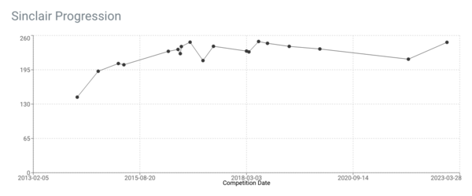

Weightlifting applies to life. Who would have thought?

From my experience, when you tell people you go to the gym, you receive the common notions: “do you even lift, brah?”, being more attractive to women, looking good and feeling confident, “what do you bench?”, “do you count your macros?”, “what do you bench?”, “I want to lose weight for the summer”, the list of stereotyping continues.

A few nights ago, a friend and I engaged in a philosophical discussion - at the gym, of course. That discussion was about taking risks.

In weightlifting, you compete (that’s a revelation for most).

Competition, to a layperson, sounds simple. You step onto a platform and lift weights.

Simple, but is freakishly challenging.

And why is it challenging?

The two lifts in weightlifting, the snatch and clean and jerk require precision as well as strength.

You are given three attempts at each of those lifts.

Hours of training come down to those three attempts. You need to make those lifts sometimes at weights you have never done before or struggle to do for a time that matters the most.
See the challenge? And when you hear about challenges, some would thrive, but I know I get fearful.
The fear can be many things:

- scared the weight may hurt me
- scared I may not make the lift
- scared I may not make any lift, hence not post a total and “bomb”

Ultimately, the outcome is uncertain, and we want a certain outcome.

How do we control this outcome?

We play it safe. Well, I know I play it safe.

I lift pretty much the same.

The problem with playing it safe is that we never improve.

Challenging oneself is about getting out of the comfort zone. You might fail or you might succeed beyond what you would in your zone of safety. Failure sucks. Failure is scary. Failure is worse than heartbreak. But these are things that build character. This is the risk you must take.

I approach weightlifting with safety and I am rewarded with lifting the same weights and no real improvement.

However, it’s best the break yourself on the platform, or fail at least trying.

And for most of my life, I have been playing it relatively safe.

Yes, I moved back to part-time work to focus on the crazy idea. All within the comfort of my parent’s home. Yes, I started to create content online. But still, feel comfortable. I’m not stretching myself.

I don’t need to go off and climb Mt. Everest, but you can start that first step.

For me, a stretch would be to change careers. So, I’ve started applying for jobs. Rejection hurts, but I’ll keep going.

With the career switch, what scares me is leaving the comfort of optometry - a stable career, well-paid, and in demand.

What happens when I do become a software developer, I might hate the work. But I will never know until I try.

And even if I do, I can strive for the next change again… and again if I have to. If you have to?

Another thing is that knowing is only half the battle.

“Analysis by paralysis”, all these cognitive concepts, even if we know about them, won’t solve the problem.

Action will.

So, take that first step.
